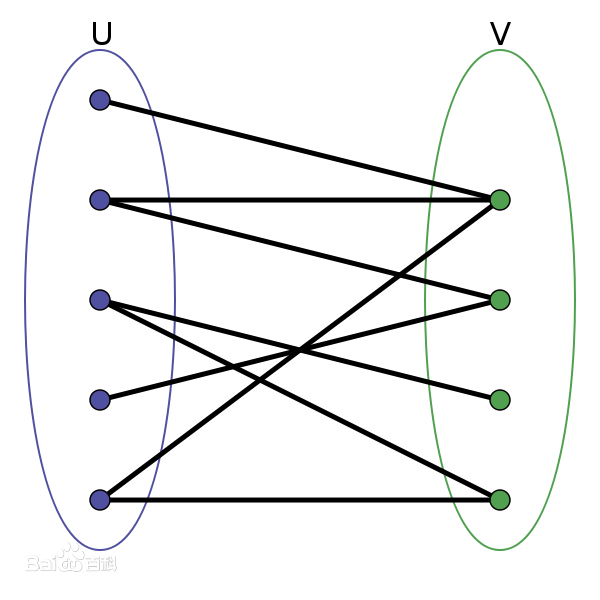

# README

[TOC]


## 代码结构

`function.h` 为包含头文件，其中定义了常量、变量以及常用函数 。其中 `perfix` 为数据文件夹路径， `ninput` 与 `noutput` 为输入与输出的文件名，修改后各个算法的输入也会随之变化。（地图生成程序默认输出为输入文件）

`Enumeration.cpp` 为暴力枚举法

`Greedy.cpp` 为贪心法

`KM_DFS.cpp` 为使用DFS的KM算法

`MinimumCostFlow.cpp` 为最小费用最大流算法

`MapGenerator.cpp` 为地图生成程序，需要输入地图大小，货物G/仓库W的数量以及要随机生成地图的数量，生成的文件输出为 `function.h` 定义的文件夹 `perfix` 下以 `ninput` 命名的文件


## 题目

### 问题描述

网格上有若干个货物和仓库，可以往水平方向或垂直方向搬运每个货物到相邻的仓库中。每个仓库只能容纳一个货物。至少使用两种思路求让这些货物放到不同仓库所需要的搬运最小路程（单位：格）。 

### 数据输入

$M*N (1<M,N<100)$ 网格，地图中的 $W$ 和 $G$ 分别表示仓库和货物的位置，个数相同，最多有 100 个仓库，其它空位置用 $.$ 表示。  

### 结果输出

所需要的最小路径。

### 输入样例


## 解法介绍

### 方法一：暴力枚举法

#### 概述与算法原理

枚举法崇尚的就是一个暴力，其思想也十分简单易理解——只要列举出所有情况，就能从中找到最优情况。

因此，在枚举法中，我们计算出货物与仓库之间的邻接矩阵，然后从初始状态开始递归，将每一件货物匹配每一个仓库，进入下一个状态。枚举法的解空间呈现爆炸式增长，只能适配数据量特别小的数据。

#### 变量

定义一个全局变量 $min\_cost$ 初始化为INF，用于保存当前完全匹配后的最小移动距离花费；

使用 $linked$ 记录当前每件货物的**匹配情况**；

两个 $vis$ 数组 $vis\_g$ 与 $vis\_w$ 分别记录每次寻找增广路过程中货物与仓库的**访问情况**；

$g$ 为邻接矩阵，存储每件货物与每个仓库之间的**距离**。

#### 算法核心步骤

1. 设置初始状态并计算邻接矩阵
2. 两层for循环寻找未匹配货物与未匹配仓库。若找到则转到步骤3，若此时都完成匹配则转到步骤5
3. 将步骤2中找到货物与仓库匹配，进入新状态进行递归（转到步骤2），递归返回后转到步骤4
4. 回溯，继续for循环寻找新的匹配，转到步骤2
5. 统计边权值和，与当前最小花费相比较并进行更新

#### 复杂度

在递归状态中要进行两层循环，我们令输入的货物与仓库数量为n，则复杂度计算为 $n*(n-1)*(n-2)*...*1$ ，即最终复杂度为 $O(n!)$ 

#### 改进方向

暴力算法就不说什么改进方向了，可以提一点做的小小优化。在递归中我设置检验标志flag，在进行匹配枚举的同时检测是否完全完成匹配，这样就不需要再进行一次遍历进行检测，只要找到了未匹配的货物/仓库则表明此时未完全匹配，并将flag设为false。

另外一个小优化是对于vector的vis数组，我测试发现使用int类型比使用bool类型更快一点，因此使用了int作为vis数组的类型，用1/0表示是否匹配。


### 方法二：贪心法（可行解）

#### 概述与算法原理

贪心法的基本思路是，对于每一个货物，选择此时与其最接近的仓库进行存储。如果某货物与两仓库的距离相同，我将两者都进行考虑，进入两种递归状态。因此在枚举法的基础上进行修改。

#### 变量

定义一个全局变量 $min\_cost$ 初始化为INF，用于保存当前完全匹配后的最小移动距离花费；

使用 $linked$ 记录当前每件货物的**匹配情况**；

两个 $vis$ 数组 $vis\_g$ 与 $vis\_w$ 分别记录每次寻找增广路过程中货物与仓库的**访问情况**；

$g$ 为邻接矩阵，存储每件货物与每个仓库之间的**距离**。

#### 算法核心步骤

1. 设置初始状态并计算邻接矩阵
2. 两层for循环寻找未匹配货物与未匹配仓库的最小距离。若有未完全匹配的货物/仓库则转到步骤3，若此时都完成匹配则转到步骤5
3. 再进行循环，当此时花费等同与最小花费时，将货物与仓库匹配，进入新状态进行递归（转到步骤2），递归返回后转到步骤4
4. 回溯，继续for循环寻找新的匹配，转到步骤2
5. 统计边权值和，与当前最小花费相比较并进行更新

#### 复杂度

在复杂度上，当从第一件货物开始到其对应的仓库的距离呈现递增顺序时，此时为最优情况，时间复杂度为 $O(n)$ ；当每件货物与仓库距离都相同时为最坏情况，此时时间复杂度与枚举法相同，为 $O(n!)$ 。

#### 问题与改进

贪心法得到是是一个可行解而不是最优解，在某些输入下获得的结果并非最优解，以其思路进行改进的结果即接下来的KM算法。


### 方法三：KM算法（DFS）

> 参考链接：
>
> [KM算法详解+模板](https://www.cnblogs.com/wenruo/p/5264235.html)
> [二分图最大权完美匹配（KM算法）](https://www.cnblogs.com/GK0328/p/13674314.html)
> [二分图/二分图最大匹配/二分图最大权完美匹配 - KM算法](https://www.cnblogs.com/stelayuri/p/13380493.html)

#### 概述

对于我们这个问题，**KM算法**应该算是解决 **“二分图最大权完美匹配”** 问题的一个专门的算法。其所解决的“二分图最大权完美匹配”问题，是我们熟知的“二分图最大匹配”的**匈牙利算法**进阶而来，但所求的问题实际上存在共通点。

所以KM算法可以说是套在匈牙利算法之上的一个算法，它的核心同样是像匈牙利算法，通过多次循环寻找增广路从而求出最优解，并在此基础上增加权值限制。

对于我们的问题，其模型可以称为**“二分图最小权完美匹配”** 。**二分图**的定义为顶点集合 $V$ 可以被分割为两个互不相交的子集 $A,B$ 且图中每条边 $(i,j)$ 所连接的两个顶点分属于这两个不同的顶点集 $\{i\in A,j\in B\}$ 。简单来说就是图中的顶点可以被分成互不相交的两个点集，每个点集中的顶点互不相连。而**二分图最小权完美匹配**指的是在二分图中，每条边有对应的权值，而我们的目标是让两个点集中的顶点通过边相连，且这些边的边权之和最小。（图源百度百科）



可以发现，在我们的问题中，我们将货物定义为点集 $G$ ，将仓库定义为点集 $W$ ，将货物与仓库的最短距离定义为边权。这个问题就转换成了一个点集全相连的**二分图最小权完美匹配**问题。

但KM算法是解决二分图最大权完美匹配问题，因此做的一个关键的修改是，**将边权取反**，这是一个很巧妙的转换。在正数转换为负数的过程中，数的大小顺序就发生了改变，这个问题就转换为了**二分图最大权完美匹配**问题，因此我们可以使用KM算法进行问题的求解。同时只需要在计算结果，即最短路径时，将边权再次取反求和即可得到最短路径之和。

#### 变量

$g$ 为邻接矩阵，存储每件货物与每个仓库之间的**距离**，即**边权**（进行了**取反**）；

两个 $val$ 数组 $val\_g$ 与 $val\_w$ 分别记录货物与仓库集的**匹配期望值**，在一些资料中也叫做**顶标**，满足 $val\_g[i]+val\_w[j]\ge w[i][j]$ ；

两个 $vis$ 数组 $vis\_g$ 与 $vis\_w$ 分别记录每次寻找增广路过程中货物与仓库的**访问情况**；

$linked$ 数组记录每个仓库的**匹配情况** （-1表示未匹配）；

$slack$ 数组记录匹配中每件货物要选择任意仓库作为其匹配对象需要**降低的期望值的最小值**。

#### 算法原理

补充相关概念定义

**相等边：**满足 $val\_g[i]+val\_w[j]= g[i][j]$ 的边 $(i,j)$ ；

**相等子图：**由相等边构成的子图；

**交错树：**由增广路构成的树。

KM算法的结论为：

**若由二分图中所有满足 $A[i]+B[j]=w[i,j]$ 的边 $(i,j)$ 构成的子图(称做相等子图)有完备匹配，那么这个完备匹配就是二分图的最大权匹配。**

#### 算法核心步骤

1. 设置最大期望值
2. 利用匈牙利算法找增广路
3. 找到增广路，匹配成功，退出
4. 找不到，最小程度降低货物的期望值，提升仓库的期望值
5. 转到步骤2开始重复

同时保证在每次进行匈牙利算法时仓库只访问一次。

#### 复杂度

DFS版本的KM算法在每次寻找到增广路之后会将vis数组完全清空重新建树，因此其时间复杂度为 $O(n^2m)$ ，其中每个找增广路的点最坏时间复杂度为 $O(m)=O(n^2)$ 。因此最坏时间复杂度为 $O(n^4)$  。

#### 改进方向

KM算法有很多改进方法，如记录前驱结点使用BFS，其不用每次都清除vis数组，在时间复杂度上最坏情况为 $O(nm)=O(n^3)$ 等，其他还有优化 $slack$ 数组等方法。


### 方法四：最小费用最大流

> 参考链接：
>
> [算法学习笔记(31): 最小费用最大流_知乎](https://zhuanlan.zhihu.com/p/127046673)
> [最小费用最大流算法](https://blog.csdn.net/judyge/article/details/45013593)
> [Edmonds-Karp算法（EK算法）简单讲解及实现](https://blog.csdn.net/weixin_44176696/article/details/106587629)

#### 概述

对于我们这个问题，**最小费用最大流**也是一个很有效的解决方法。在任何容量网络的最大流流量是唯一确定的，但最大流并不唯一，由于增广路的特性，通过不同的增广路也可以得到相同流量的最大流。

因此在最大流中，我们在每条流原来的**容量限制**基础上，增加了其费用v。而最小费用最大流就是想要在所有的最大流中找到一个总费用最小的最大流。

我们还是以前面二部图的图像为例：


可以发现，当我们在货物集U前增加一个超源点，在仓库集V后面增加一个超汇点，如下图：


对于超源点与超汇点，我们令与其相接的点**最大容量为1**，**费用为0**。这样我们就很巧妙地将问题转换为一个最小费用最大流问题。

设置最大容量为1，由于**1是单位最小流量**，因此每个**货物顶点**只能寻找**一条费用最少的边**作为其输出到超汇点的流，且每个**仓库顶点**也只能接受**一条费用最少的边**作为其接受超源点输入的流。而设置费用其实也不一定需要为0，只需要都保证相同，不影响结果即可。

#### 变量

$pre$ 为前驱结点索引数组，存储BFS时每个结点的前驱结点，方便进行回溯寻找增广路；

$dist$ 为每个顶点到源点的最小距离，通过BFS更新。

#### 算法原理

寻找最大流的方法是从某个可行流出发，找到关于这个流的一条增广路P，沿着P调整f，对新的可行流又试图寻找关于它的增广路，循环直至不存在增广路为止。

求最小费用最大流：

如果f是流量为f1的可行流中费用最小者，而p是关于f的所有增广路中费用最小的增广路，那么沿着p去调整f，得到可行流_f，就是流量为f1的所有可行流中的费用最小者。

这样当f是最大流时，它也就是所要求的最小费用最大流了。

#### 算法核心步骤

1. 开始取 $f(0)={0}$ ; 
2. 一般若在第 $k-1$ 步得到的最小费用流为 $f(k-1)$ ，则构造伴随网络 $W(f(k-1))$ ; 
3. 在 $W(f(k-1))$ 中寻找从Vs到Vt的最短路，若不存在则转到步骤5，存在转到步骤4; 
4. 在原网络G中得到相应的增广路P，在P上对 $f(k-1)$ 进行调整；调整后新的可行流为f(k)，转到步骤二； 
5. $f(k-1)$ 为最小费用最大流，算法结束。

#### 复杂度

SPFA算法最坏情况下时间复杂度为 $O(VE)$ 

#### 改进方向

将队列换成栈，实际上是相当于将BFS更改为DFS，在寻找负权环时可能有更高效率，但最坏时间复杂度没有提升。


## 关键代码

### 枚举法

`Enumeration.cpp` 

```c++
//枚举回溯法
void enumerationMatch(vector<int> tmp_linked, vector<int> tmp_visg, vector<int> tmp_visw)
{
    //完全匹配标志
    bool flag = true;
    //如果未完全匹配则枚举回溯
    for(int i=0; i<num_g; i++) {
        if(tmp_visg[i]==1) //寻找未匹配货物
            continue;
        tmp_visg[i] = 1;
        for(int j=0; j<num_w; j++) {
            if(tmp_visw[j]==1) //寻找未匹配仓库
                continue;
            flag = false; //未完全匹配
            tmp_visw[j] = 1;
            tmp_linked[i] = j;
            enumerationMatch(tmp_linked,tmp_visg,tmp_visw);
            tmp_linked[i] = 0;
            tmp_visw[j] = 0;
        }
        tmp_visg[i] = 0;
    }
    
    //已经全部完成匹配
    if(flag) {
        int ans=0; //统计匹配边权值和
        for(int i=0;i<num_g;i++) {
            ans += g[i][tmp_linked[i]];
        }
        min_cost = min_cost>ans? ans:min_cost;
    }
}
```

### 贪心法

`Greedy.cpp` 

```c++
//贪心回溯法
void Greedy(vector<int> tmp_linked, vector<int> tmp_visg, vector<int> tmp_visw)
{
    //找当前最短路径并判断是否完全匹配
    int cur_min = INF;
    bool flag = true;
    for(int i=0; i<num_g; i++) {
        if(tmp_visg[i]==1)
            continue;
        for(int j=0; j<num_w; j++) {
            if(tmp_visw[j]==1)
                continue;
            flag = false;
            cur_min = cur_min>g[i][j]? g[i][j]:cur_min;
        }
    }
    //完全匹配则进入结算
    if(flag) {
        int ans=0; //统计匹配边权值和
        for(int i=0;i<num_g;i++) {
            ans += g[i][tmp_linked[i]];
        }
        min_cost = min_cost>ans? ans:min_cost;
    }
    //如果未完全匹配则贪心回溯
    for(int i=0; i<num_g; i++) {
        if(tmp_visg[i]==1)
            continue;
        for(int j=0; j<num_w; j++) {
            if(tmp_visw[j]==1 || g[i][j]!=cur_min) //此时不是最短路径
                continue;
            tmp_visg[i] = 1;
            tmp_visw[j] = 1;
            tmp_linked[i] = j;
            Greedy(tmp_linked,tmp_visg,tmp_visw);
            tmp_linked[i] = 0;
            tmp_visw[j] = 0;
            tmp_visg[i] = 0;
        }
    }

}
```

### KM_DFS

`KM_DFS.cpp` 

```c++
bool DFS(int x)//hungary匈牙利算法
{
    vis_g[x]=true; //标记本次匹配涉及的货物
    for(int y=0; y<num_w; y++) {
        if(!vis_w[y]) { //保证每次寻找增广路时仓库只访问一次
            int tmp = val_g[x]+val_w[y]-g[x][y];
            if(tmp==0) { //两者都是最优配对选择
                vis_w[y]=true;
                if(linked[y]==-1 || DFS(linked[y])) { //匈牙利算法寻找增广路
                    linked[y] = x;
                    return true;
                }
            }
            else if(slack[y]>tmp) { //存储匹配还需要的最小期望值
                slack[y] = tmp;
            }
        }
    }
    return false;
}

int KM()
{
    memset(linked,-1,sizeof(linked));
    memset(val_w,0,sizeof(val_w)); //仓库期待值初始化为0(有货物就行)

    //找每个货物最近的仓库并赋予货物期待值
    for(int i=0; i<num_g; i++) {
        val_g[i] = -INF;
        for(int j=0; j<num_w; j++) {
            if(g[i][j]>val_g[i]) val_g[i]=g[i][j];
        }
    }
    for(int x=0; x<num_g; x++) {
        memset(slack,INF,sizeof(slack));
        //因为货物需要全部入仓，因此只要没找到匹配就降低期望一直找
        while(true) {
            memset(vis_g,0,sizeof(vis_g));
            memset(vis_w,0,sizeof(vis_w));
            if(DFS(x))
                break; //找到匹配时结束
            int d=INF;
            for(int j=0; j<num_w; j++) { //找到上一趟中没有被匹配，且最小松弛值最小的仓库的最小松弛值
                if(!vis_w[j]&&d>slack[j]) d=slack[j];
            }
            for(int i=0; i<num_g; i++) {
                if(vis_g[i]) val_g[i]-=d; //降低上一趟访问过的货物的期望值
            }
            for(int j=0; j<num_w; j++) {
                if(vis_w[j])
                    val_w[j]+=d; //增加上一趟匹配过的仓库的期望值
                else
                    slack[j]-=d; //减少上一趟没有被匹配的仓库的松弛值(货物期望值已降低)
            }
        }
    }

    int ans=0; //统计匹配边权值和
    for(int i=0;i<num_w;i++) {
        if(linked[i]!=-1) ans+=g[linked[i]][i];
    }
    return -ans; //返回最大的相反数。即要求的最小
}
```

### 最小费用最大流

`MinimumCostFlow.cpp` 

```c++
//求最短路径的SPFA算法
void SPFA(int s)
{
    queue<int> que;
    int u;
    //初始化
    for(int i=0; i<=vertex; i++) { 
        dist[i] = INF;
        pre[i] = -1;
        inq[i] = 0;
    }
    dist[s] = 0;
    que.push(s);
    inq[s] = 1;
    while(!que.empty()) {
        u = que.front();
        que.pop();
        inq[u]=0;
        //更新u的邻接点的dist[], pre[], inq[]
        for(int i=0; i<=vertex; i++) {
            int v=i;
            if(G[u][v].c_f==0) //表示(u,v)没有边
                continue;
            if(G[u][v].v==INF)
                G[u][v].v = -G[v][u].v;
            if(dist[v] > dist[u]+G[u][v].v) { //松弛操作
                dist[v] = dist[u]+G[u][v].v;
                pre[v]=u;
                if(inq[v]==0) {
                    que.push(v);
                    inq[v]=1;
                }  
            }
        }
    }
}

void ford_fulkerson(int s,int t)
{
    SPFA(s);
    while(pre[t]!=-1) { //pre为-1表示没有找到从s到t的增广路径
        min_cost+=dist[t]; //将这一条最短路径的值加进min_cost
        min_c_f = INF;
        int u=pre[t], v=t;
        //计算增广路径上的残留容量
        while(u!=-1) {  
            if(min_c_f > G[u][v].c_f) min_c_f = G[u][v].c_f;
            v=u;
            u=pre[v];
        }
        u=pre[t], v=t;
        while(u!=-1) {
            G[u][v].f+=min_c_f; //修改流
            G[v][u].f=-G[u][v].f;
            G[u][v].c_f=G[u][v].c-G[u][v].f; //修改残留容量
            G[v][u].c_f=G[v][u].c-G[v][u].f;
            v=u;
            u=pre[v];
        }
        SPFA(s);
    }
}
```

